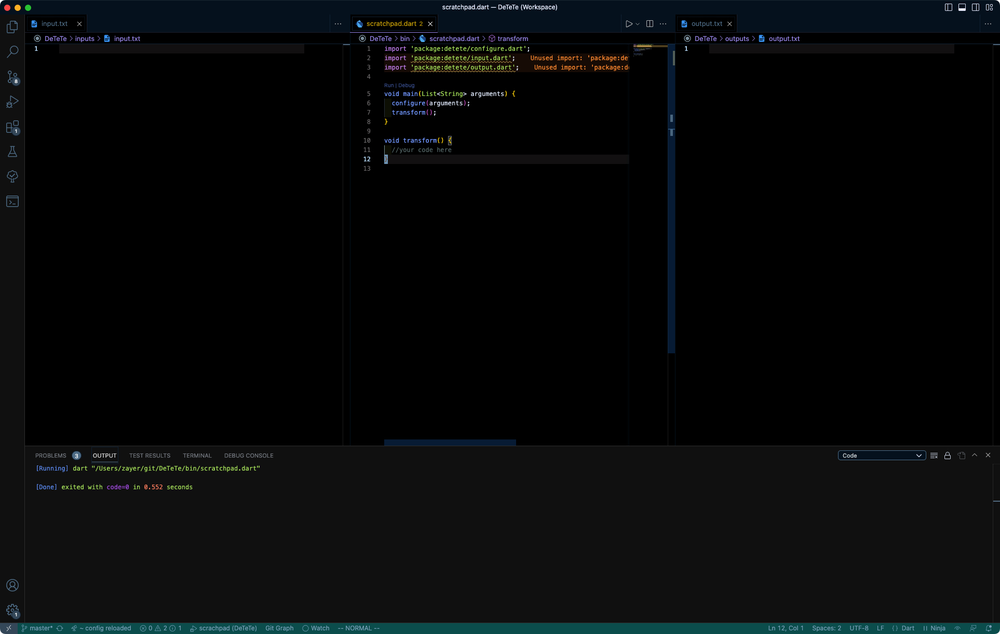

# Examples

## One input and one output
For clarity it's recomended to open files in three panels:
* input _inputs/input.txt_ to the left
* script _bin/scratchpad.dart_ in the middle
* output _outputs/output.txt_ to the right

It should look something like that:


In this example we will filter logs.
Paste text below to _inputs/input.txt_ and save file.
```
2023-08-13 22:28:12.711 4216-4319/? D/AccountManagerService: getUserAccounts0
2023-08-13 22:28:12.715 10749-14785/? V/FA: Inactivity, disconnecting from the service
2023-08-13 22:28:12.734 14651-14740/? I/BorderAgentScannerImpl: Stopping mDNS service browser [CONTEXT service_id=305 ]
2023-08-13 22:28:12.735 4216-4319/? D/AccountManagerService: getUserAccounts0
2023-08-13 22:28:12.736 14919-14919/? I/SAIV_FACE: File : /data/user/0/com..faceservice/face/face_data
2023-08-13 22:28:12.740 14651-14651/? D/BoundBrokerSvc: onUnbind: Intent { act=com.google.android.gms.auth.service.START pkg=com.google.android.gms }
2023-08-13 22:28:12.746 4216-6695/? D/AlarmManager: setInexact Intent (T:3/F:0/AC:false) 20230813T222836 - CU:10030/CP:21555
2023-08-13 22:28:12.746 4216-6695/? I/AlarmManager: setLocked to kernel - T:2 / 20230813T222902, SetElapsed=2334798568, nowELAPSED=2334748890
2023-08-13 22:28:12.746 4216-6695/? I/AlarmManager: setLocked to kernel - T:3 / 20230813T222822, SetElapsed=2334758769, nowELAPSED=2334748890
2023-08-13 22:28:12.749 21555-13678/? I/NetworkScheduler.Stats: (REDACTED) Task %s/%s started execution. cause:%s exec_start_elapsed_seconds: %s
2023-08-13 22:28:12.753 4216-6695/? D/AccountManagerService: getUserAccounts0
2023-08-13 22:28:12.769 21555-13813/? I/NetworkScheduler.Stats: (REDACTED) Task %s/%s finished executing. cause:%s result: %s elapsed_millis: %s uptime_millis: %s exec_start_elapsed_seconds: %s
2023-08-13 22:28:12.779 14919-14919/? I/[SCE_3]: [SmartCropping v3.0] native version is 2018-12-03-01
2023-08-13 22:28:12.779 14919-14919/? I/[SCE_3]: [SmartCropping v2.0] DB path is /system/saiv/smartcropping_2.0/db
2023-08-13 22:28:12.782 4216-6695/? D/WifiPermissionsUtil: canAccessScanResults: pkgName = com.sec.android.sdhms, uid = 1000
2023-08-13 22:28:12.786 4216-6695/? D/ConnectivityService: filterNetworkStateForUid() uid: 10030, pid: 21555
2023-08-13 22:28:12.786 4216-6695/? D/ConnectivityService: isNetworkWithLinkPropertiesBlocked: uid=10030, vpn=DISCONNECTED,false
2023-08-13 22:28:12.786 6001-6001/? I/SKBD: anc isTosAccept false
2023-08-13 22:28:12.794 4216-4811/? D/AlarmManager: Cancel Alarm calling from uid:10030 pid :21555 / op:PendingIntent{725156f: PendingIntentRecord{e32260d com.google.android.gms broadcastIntent}}
2023-08-13 22:28:12.796 4216-4811/? I/AlarmManager: setLocked to kernel - T:2 / 20230813T222902, SetElapsed=2334798568, nowELAPSED=2334748940
2023-08-13 22:28:12.796 4216-4811/? I/AlarmManager: setLocked to kernel - T:3 / 20230813T222822, SetElapsed=2334758769, nowELAPSED=2334748940
2023-08-13 22:28:12.798 14919-14919/? I/[SCE_3]: smart_cropping in srcb_Smartcrop_Init() : 504219644672 & its size is 8
2023-08-13 22:28:12.798 14919-14919/? I/[SCE_3]: SmartCropper Handle after srcb_Smartcrop_Init() : 504219644672 & its size is 8
2023-08-13 22:28:12.798 14919-14919/? I/[SCE_3]: long bytes num: 8
```

Now paste text below into _transform() mothod in _bin/scratchpad.dart_.
```dart
input.readAsLines() //read input file (by default it's inputs/input.txt) as List<String>
      .where((element) => element.contains('AlarmManager')) //filter lines by given text
      .writeIterableAsString(); //write result to output file (by default it's outputs/output.txt)
```

File should look like this:
```dart
import 'package:detete/configure.dart';
import 'package:detete/input.dart' as input;
import 'package:detete/output.dart' as output;
import 'package:detete/utils.dart' as utils;

void main(List<String> arguments) {
  configure(arguments);
  transform();
}

void transform() {
input.readAsLines() //read input file (by default it's inputs/input.txt) as List<String>
      .where((element) => element.contains('AlarmManager')) //filter lines by given text
      .writeIterableAsString(); //write result to output file (by default it's outputs/output.txt)
}
```

Save file and notice as it's immediately executed and output is written to _outputs/output.txt_.

## Multiple inputs and outputs
Script can have more that one input and/or output (for merging files, outputing data in various formats at one etc.).
```dart
  var content1 = input.readAsLines(filepath: "inputs/input1.txt");
  var content2 = input.readAsLines(filepath: "inputs/input2.txt");
  var outputContent1 = content1 + content2;
  var outputContent2 = outputContent1.sublist(0, 5);
  output.writeIterableAsString(outputContent1, filepath: "outputs/output1.txt");
  output.writeIterableAsString(outputContent2, filepath: "outputs/output2.txt");
```